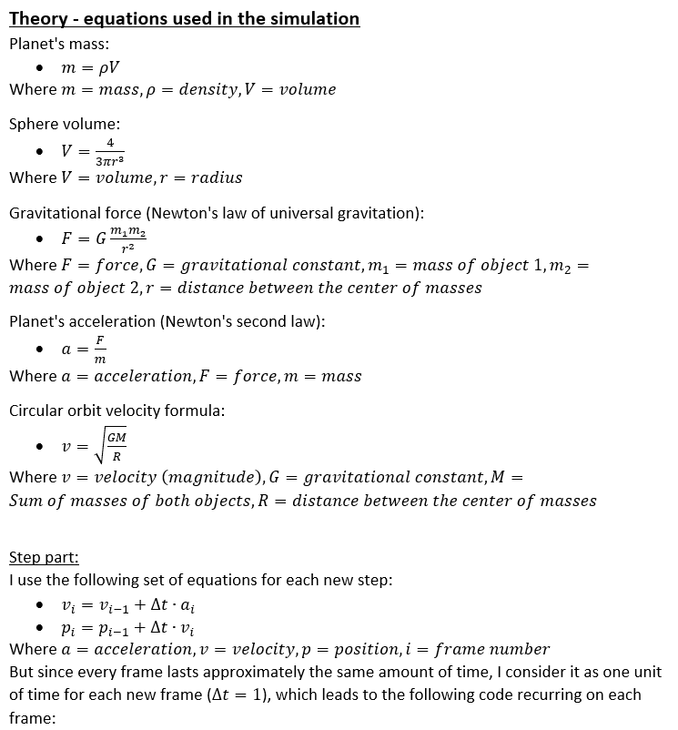
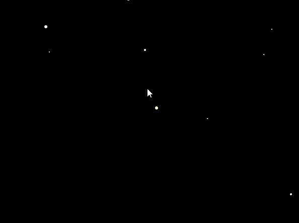
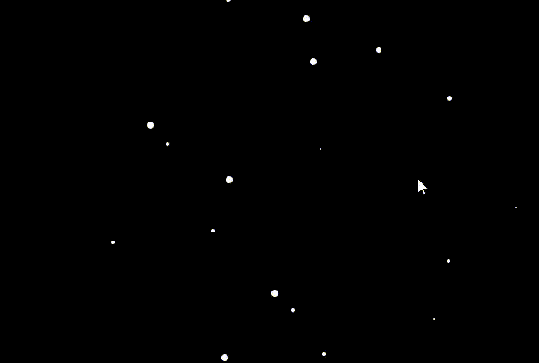

# Gravity Simulation
Computer Graphics Lab  
This simulation demonstrate the interaction between planetary bodies through gravitational forces. The user can create planets with different size, density and initial velocity, can edit each planet separately and control the gravitational constant. When the setup is ready, the user can then click on the Start button and the simulation will begin.  
The concept of gravity is shown here as a force of attraction between each pair of planets that the user created. Each different setup will produce different results which may include collisions or any kind of periodic revolutions such as 2 planets orbit around each other.
Some collisions make a big explosions and create several smaller planets/asteroids, while others, don’t break things apart but leave impact craters. For instance, Mars has been shaped by impact. Its northern half is smooth and low, its southern half mountainous and rough.  
  
```cpp
if (!isPaused)
{
  velocity += acceleration;
  planet.move(velocity);
}
```

## Weekly Report
[Week 1](#272---53-6-hours-total)  
[Week 2](#63---123-10-hours-and-30-minutes-total)  
[Week 3](#133---193-5-hours-total)  
[Week 4](#203---263-12-hours-total)  
[Week 5](#273---24-8-hours-total)  
[Week 6](#34---94-0-hours-total)  
[Week 7](#104---164-5-hours-total)  
[Week 8](#244---304-12-hours-total)  
[Week 9](#15---75-7-hours-total)  
[Week 10](#85---145-7-hours-total)  
[Week 11](#155---215-12-hours-and-30-minutes-total)  
[Week 12](#225---285--hours-total)  

### <ins>27.2 - 5.3:</ins> (6 hours total)
Coming up with the general idea of the project and searching for the best fitting language and graphics library for it - about 1 hour.  
Studying the Simple and Fast Multimedia Library (SFML) - about 4 hours.  
Setting up a Github repository and a Visual Studio project with a simple working demo window of the SFML - about 1 hour.  

### <ins>6.3 - 12.3:</ins> (10 hours and 30 minutes total)
Creating the Planet class which encapsulates everything that a planet have, and the PlanetSystem class which includes a planet vector and is responsible for the general settings of the simulation - about 2 hours.  
What I got so far:  
  
Creating a Slider Class to use in menus - about 2 hours and 15 minutes.  
Creating a Button Class to use in menus - about 40 minutes.  
Handling the creation of planets by clicking on the screen - about 1 hour.  
Creating a CheckBox Class to use in menus - about 15 minutes.  
Menu Components:  
  
Shaping the menu area and disable the creation of a planet inside the menu - about 2 hours.  
Preventing planets from intersecting one another on creation - about 45 minutes.  
Centralized the menu items and bindind the gravitational constant with a slider - about 1 hour and 30 minutes.  
  

### <ins>13.3 - 19.3:</ins> (5 hours total)
Creating the arrow from each planet which represent its velocity vector - about 3 hours.  
What I got so far:  
  
Adding support for the acceleration arrow as well, and adjusting the arrow dimensions to look good at any size - about 2 hours.  
Didn't make any more progress due to illness.  

### <ins>20.3 - 26.3:</ins> (12 hours total)
Encapsulating the menu items in a Menu class in preperation for adding planet-specific menu, coming up with the solution on how the Menu class can communicate with the PlanetSystem class on menu item's event and implementing it - about 4 hours and 30 minutes  
Changing the menu items' classes to work more efficiently with the Menu class - about 3 hours.  
Creating another menu to edit planet attributes - about 4 hours and 30 minutes.  
Demonstration of the second menu:  
  

### <ins>27.3 - 2.4:</ins> (8 hours total)
Clicking on a planet will now open its edit menu - about 30 minutes.  
Adding labels for the sliders - about 15 minutes.  
Adding a button that remove every planet - about 15 minutes.  
Clicking inside a planet while setting its velocity will now keep it in rest - about 15 minutes.  
Planets now explodes to several smaller planets on collision. The smaller planets have somewhat random position, radius and velocity. There are still minor bugs on edge cases - about 3 hours.  
Adding statistics on the buttom of the main menu - about 15 minutes.  
Spent some time adding function descriptions and general comments - about 3 hours and 45 minutes.  

### <ins>3.4 - 9.4:</ins> (0 hours total)
Didn't make any progress due to personal things.  

### <ins>10.4 - 16.4:</ins> (5 hours total)
Compensate on last week's progress.  
Bug fix - when the velocity or acceleration vector became 0, their arrow stayed the same as before, instead of disappearing - about 15 minutes.  
On planets collision, if one of the planets is large and the other is small, the large planet will absorb the small planet - its radius and density will increase - about 45 minutes.  
Added Particle class and explosion effect when 2 planets collide - about 1 hour and 30 minutes.  
Explosion effect:  
  
Added many small particles in the background that represent far planets/suns - about 15 minutes.  
Adjusting the particles' velocity with respect to the planet's velocity - about 15 minutes.  
Adding more function descriptions and learning how to use textures in SFML - about 1 hour and 30 minutes.  

### <ins>24.4 - 30.4:</ins> (12 hours total)
Adding sparkling effect to background stars - about 1 hour and 30 minutes.  
a gif of every star with this effect:  
  
Fixing a bug that planets created from collision were created on top of other new planets - about 2 hour.  
Trying to add dynamic texture to the planets - about 8 hours and 30 minutes.  
What I got so far:  
  
Which is pretty good but it doesn't look natural so I was trying to add shadows to the edge of the planet by multiplying the image:  
  
But got into problems of using 2 textures for one planet.  

### <ins>1.5 - 7.5:</ins> (7 hours total)
Adding an explanation to the report - about 2 hours and 15 minutes.  
Fixing a bug with the time elapsed - about 15 minutes.  
Trying to understand how textures works in SFML and how to combine 2 textures - about 4 hours and 30 minutes.    

### <ins>8.5 - 14.5:</ins> (7 hours total)
Finally managed to properly add surface and shadow textures to a planet, as well as support for size changing - about 6 hours.  
Without Shadow | With Shadow
--- | ---
 | 

* Note: converting them to gif made these videos a bit pixelated.  

Updating the report and searching for various planets surface's textures - about 1 hour.  

### <ins>15.5 - 21.5:</ins> (12 hours and 30 minutes total)
Adding textures for every planet, not just one - about 1 hour and 15 minutes.  
Assigning random surface texture for each planet. Planets explodes into planets with the same surface - about 1 hour and 15 minutes.  
  
**Textures:**  
Source: https://www.solarsystemscope.com/textures/  
> Textures in this pack are based on NASA elevation and imagery data. Colors and shades of the textures are tuned according to true-color photos made by Messenger, Viking and Cassini spacecrafts, and, of course, the Hubble Space Telescope.  
1. Earth   
2. Jupiter  
3. Mars  
4. Mercury  
5. Moon  
6. Neptune  
7. Saturn  
8. Sun  
9. Uranus  
10. Venus  

Initializing planets rotation with random starting point, angle and speed. Removing shadow texture from the sun surface's texture - about 45 minutes.  
Displaying the planet in the edit menu and enabling the option to change its surface - about 2 hours and 15 minutes.  
  
Enabling an option to lock and unlock a planet in its current position. Fixing a bug - when changing the planet radius (whether from its size slider in the menu or from colliding with another planet), the texture of the display planet in the edit menu gets distorted - about 2 hours and 50 minutes.  
Fixing a bug, now when wer'e on the edit menu of a planet that is being exploded or absorbed, it will go back to the main menu - about 1 hour.  
Changed background to a texture and modified the sparkling effect accordingly - about 1 hour.  
Minor features and bug fixes - about 2 hours and 10 minutes:  
* Bug fix - menu items now cannot be clicked while setting the velocity arrow.  
* Feature - clicking on a slider axis, now modifies it as well.  
* Feature - on the edit menu, the velocity direction and magnitude sliders are updated on every frame.  
* Bug fix - raised an error when a planet exploded while modifying a slider on its edit menu.  
* Bug fix - initializing, changing or locking a planet to a 0 velocity, now remembers the last direction of the velocity.  

### <ins>22.5 - 28.5:</ins> (? hours total)
The particles from planet explosions, now fade away and have colors according to the planets' surface - about 1 hour.  
Hiding the velocity direction and magnitude sliders when the planet is locked - about 15 minutes.  
Removing planets which are too far away - about 20 minutes.  
Learning about the mathematics of orbit system and adding a Sun-Earth orbital system - 
