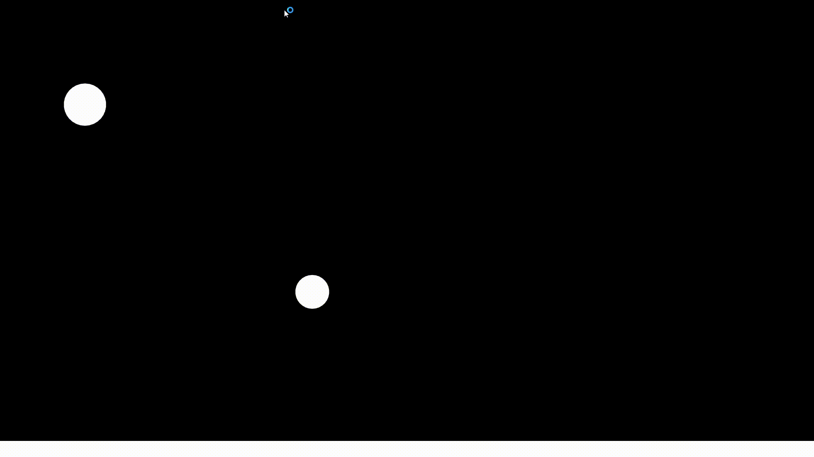

# Gravity Simulation
 Computer Graphics Lab  
Simulate gravitational forces between planetary objects.
## Weekly Report
[Week 1](#272---53-6-hours-total)  
[Week 2](#63---123-10-hours-and-30-minutes-total)  
[Week 3](#133---193-5-hours-total)  
[Week 4](#203---263-12-hours-total)  
[Week 5](#273---24-8-hours-total)  
[Week 6](#34---94-0-hours-total)  
[Week 7](#104---164-5-hours-total)  
[Week 8](#244---304--hours-total)  
### <ins>27.2 - 5.3:</ins> (6 hours total)
Coming up with the general idea of the project and searching for the best fitting language and graphics library for it - about 1 hour.  
Studying the Simple and Fast Multimedia Library (SFML) - about 4 hours.  
Setting up a Github repository and a Visual Studio project with a simple working demo window of the SFML - about 1 hour.  

### <ins>6.3 - 12.3:</ins> (10 hours and 30 minutes total)
Creating the Planet class which encapsulates everything that a planet have, and the PlanetSystem class which includes a planet vector and is responsible for the general settings of the simulation - about 2 hours.  
What I got so far:  
  
Creating a Slider Class to use in menus - about 2 hours and 15 minutes.  
Creating a Button Class to use in menus - about 40 minutes.  
Handling the creation of planets by clicking on the screen - about 1 hour.  
Creating a CheckBox Class to use in menus - about 15 minutes.  
Menu Components:  
  
Shaping the menu area and disable the creation of a planet inside the menu - about 2 hours.  
Preventing planets from intersecting one another on creation - about 45 minutes.  
Centralized the menu items and bindind the gravitational constant with a slider - about 1 hour and 30 minutes.  
  

### <ins>13.3 - 19.3:</ins> (5 hours total)
Creating the arrow from each planet which represent its velocity vector - about 3 hours.  
What I got so far:  
  
Adding support for the acceleration arrow as well, and adjusting the arrow dimensions to look good at any size - about 2 hours.  
Didn't make any more progress due to illness.  

### <ins>20.3 - 26.3:</ins> (12 hours total)
Encapsulating the menu items in a Menu class in preperation for adding planet-specific menu, coming up with the solution on how the Menu class can communicate with the PlanetSystem class on menu item's event and implementing it - about 4 hours and 30 minutes  
Changing the menu items' classes to work more efficiently with the Menu class - about 3 hours.  
Creating another menu to edit planet attributes - about 4 hours and 30 minutes.  
Demonstration of the second menu:  
  

### <ins>27.3 - 2.4:</ins> (8 hours total)
Clicking on a planet will now open its edit menu - about 30 minutes.  
Adding labels for the sliders - about 15 minutes.  
Adding a button that remove every planet - about 15 minutes.  
Clicking inside a planet while setting its velocity will now keep it in rest - about 15 minutes.  
Planets now explodes to several smaller planets on collision. The smaller planets have somewhat random position, radius and velocity. There are still minor bugs on edge cases - about 3 hours.  
Adding statistics on the buttom of the main menu - about 15 minutes.  
Spent some time adding function descriptions and general comments - about 3 hours and 45 minutes.  

### <ins>3.4 - 9.4:</ins> (0 hours total)
Didn't make any progress due to personal things.  

### <ins>10.4 - 16.4:</ins> (5 hours total)
Compensate on last week's progress.  
Bug fix - when the velocity or acceleration vector became 0, their arrow stayed the same as before, instead of disappearing - about 15 minutes.  
On planets collision, if one of the planets is large and the other is small, the large planet will absorb the small planet - its radius and density will increase - about 45 minutes.  
Added Particle class and explosion effect when 2 planets collide - about 1 hour and 30 minutes.  
Explosion effect:  
  
Added many small particles in the background that represent far planets/suns - about 15 minutes.  
Adjusting the particles' velocity with respect to the planet's velocity - about 15 minutes.  
Adding more function descriptions and learning how to use textures in SFML - about 1 hour and 30 minutes.  

### <ins>24.4 - 30.4:</ins> (? hours total)

